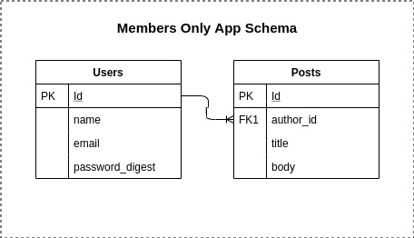

<h1 align="center">[Rails] Sessions, Cookies and Authentication / Members-Only</h1>
<p>
  
  <a href="#" target="_blank">
    
  </a>
  <a href="https://twitter.com/ae_cordova" target="_blank">
    
  </a>
  <a href="https://twitter.com/redacuve" target="_blank">
    
  </a>
</p>

___
## Description of the project 

The purpose of this project is to practice Account Signup, User Authentication and Session Management knowledge by building members only app, which allows users to create and view posts but resticts the view of the author to signed in users only.

**This Project focuses on the functionality for Users and Posts, the front end was not a priority **  

The full projects requirements and information can be found in [The Odin Project](https://www.theodinproject.com/courses/ruby-on-rails/lessons/authentication?ref=lnav)


<h3 align="center">Model Representation</h3>




### ⭐️ Built with
* Ruby on Rails


### Dev Environment Requirements:
* Ruby needs to be installed to run the code, check [here](https://www.ruby-lang.org/en/documentation/installation/) for further steps

### ⭐️ How it works

* Once you open the application, by default you will be able to see all the posts from all users, but not the Authors.

* Click on Sign Up (or Login if you already have an account)

* Fill in the information for registering.

* Once you register, you will be logged in automatically and will have access to create posts and view the author's name of the existing posts.

* To create posts, click on the Create Post link

* Fill In the Post information, title and body... 

* Once you submit it, you will be redirected to All Posts page.

* Once you have finished, you may click on the Log Out option.


### ⭐️ Running the code

#### Instructions:

1. Clone the repo

2. Navigate to the root directory

3. Run bundle install to ensure all the needed gems are installed:
    ```
    $ bundle install
    ```
3. Install Yarn
    ```
    $ yarn install --check-files
    ```
3. Migrate the DB
    ```
    $ rails db:migrate
    ```
3. Go to http://localhost:3000/ to start creating users and posts.


<!-- CONTRIBUTING -->
## Contributing

Any contributions you make are **greatly appreciated**.

1. Fork the Project
2. Create your Feature Branch (`git checkout -b feature/AmazingFeature`)
3. Commit your Changes (`git commit -m 'Add some AmazingFeature'`)
4. Push to the Branch (`git push origin feature/AmazingFeature`)
5. Open a Pull Request


## Authors

👤 **Rey David Cuevas** 
* Github: [@redacuve](https://github.com/https:\/\/github.com\/redacuve)  

👤 **Angel Cordova** 
* Github: [@aecordova](https://github.com/https:\/\/github.com\/aecordova)  
